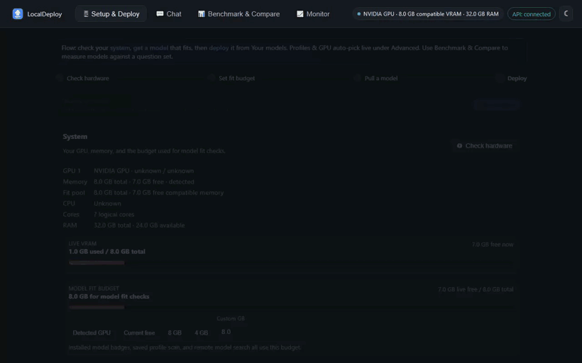

<p align="center">
  
</p>

<h1 align="center">LocalDeploy</h1>

<p align="center">
  A local web UI and API for choosing, running, and comparing AI models on your own hardware.
</p>

<p align="center">
  <a href="https://github.com/oney-erge/LocalDeploy/actions/workflows/ci.yml"></a>
  <a href="https://pypi.org/project/localdeploy/"></a>
  <a href="LICENSE"></a>
  
  
</p>

I built LocalDeploy because I needed a dependable way to choose and run local models for other work I am involved in. It became useful enough that I decided to make it public. I hope it saves someone else some setup time and trial and error.

LocalDeploy sits on top of [Ollama](https://ollama.com) and can also work with llama.cpp and loopback OpenAI-compatible runtimes. It detects the machine, estimates whether a model will fit, manages local models, and records benchmark results. LocalDeploy itself does not provide cloud inference.

<p align="center">
  
</p>

## What it does

- Detects NVIDIA, AMD, Intel, and Apple Silicon hardware, including compatible multi-GPU layouts.
- Searches the Ollama library, Hugging Face, and ModelScope GGUF repositories from one screen.
- Imports GGUF files that aren't in any registry - already on disk, or from a direct URL (e.g. GitHub Releases).
- Estimates model memory before a pull or deploy and explains when CPU offload is likely.
- Pulls, starts, switches, unloads, and deletes local models.
- Provides a streamed chat UI with image and document attachments.
- Runs repeatable local benchmarks and compares accuracy, latency, throughput, and memory use.
- Shows current VRAM, CPU, RAM, placement, request timing, and model throughput.
- Exports benchmark reports and deployment manifests for later use.

If you already know which Ollama model you want and only need a terminal chat, Ollama may be all you need. LocalDeploy is meant for the less certain part: choosing a model for a particular machine and comparing it with real runs.

## Install

The stable project entry points are `run.bat` on Windows, `run.command` on
macOS, and `run.sh` on Linux. Re-running them is safe. They use the existing
environment when it is current and repair missing dependencies when needed.
Each also accepts `doctor`, `repair`, `docker`, `logs`, and `stop`.

Install from PyPI when Python and Ollama are already available:

```bash
python -m pip install localdeploy
localdeploy
```

The launchers below can also set up a local clone and help install prerequisites.

### Windows

The installer can offer to install Python and Ollama through winget, clone the repository, create a virtual environment, and start the UI. Download it first so you can inspect it before running it:

```powershell
$installer = Join-Path $env:TEMP "localdeploy-install.ps1"
Invoke-RestMethod https://raw.githubusercontent.com/oney-erge/LocalDeploy/main/scripts/install.ps1 -OutFile $installer
& $installer
```

From an existing clone:

```powershell
git clone https://github.com/oney-erge/LocalDeploy.git
cd LocalDeploy
.\scripts\start.ps1
```

The script creates `.env`, `config.json`, and `.venv`, starts Ollama when it is installed, and opens `http://localhost:8000/ui`. Stop it with `.\scripts\stop.ps1`. You can also double-click `start.bat` from a clone or ZIP download.

### macOS and Linux

```bash
git clone https://github.com/oney-erge/LocalDeploy.git
cd LocalDeploy
./scripts/start.sh
```

If Python 3 or Ollama is missing, the launcher offers to install it for you (Homebrew on macOS; apt, dnf, pacman, or zypper for Python and the [official installer](https://ollama.com/download) for Ollama on Linux) and asks before running anything. Answer no, or run non-interactively, and it prints the exact manual command instead.

On macOS you can also double-click `start.command` from a clone (it opens Terminal and runs the launcher). A ZIP download strips the executable bit, so after unzipping run `chmod +x start.command scripts/*.sh` once, or just use `git clone` as above.

The launcher starts Ollama when it is installed but not already reachable, then keeps the LocalDeploy server in the foreground. Press Ctrl+C to stop LocalDeploy. Run `./scripts/stop.sh --ollama` if you also want to stop an Ollama process started by the launcher. Set `START_OLLAMA=false` in `.env` when another service manages Ollama.

### Docker

The published container bundles Ollama, so Python is not needed on the host:

```bash
docker run -d --name localdeploy \
  -p 127.0.0.1:8000:8000 \
  -v localdeploy-data:/data/localdeploy \
  -v ollama-data:/root/.ollama \
  ghcr.io/oney-erge/localdeploy:0.6.0
```

To build from source instead:

```bash
git clone https://github.com/oney-erge/LocalDeploy.git
cd LocalDeploy
docker compose up --build -d
```

Open `http://localhost:8000/ui`. Use `docker compose down` to stop it. The default port mapping only listens on `127.0.0.1`. Model and profile data live in named volumes. NVIDIA passthrough is available in `docker-compose.yml` and requires the [NVIDIA Container Toolkit](https://docs.nvidia.com/datacenter/cloud-native/container-toolkit/install-guide.html).

## Basic use

Open the UI and check the detected hardware and memory budget. Use Get a model to search or enter an Ollama tag, then review the fit estimate before downloading. Once the model is present, deploy it and use the Chat tab. The Benchmark tab can compare several installed models, and Monitor shows what is happening while they run.

A new install starts without profiles or models. Pulling the first model creates its profile and makes it the default. `config.example.json` is a field reference, not a list of models that are assumed to be installed.

The hardware and memory estimates are guidance. Drivers, runtime versions, context length, desktop GPU use, and quantization all affect the actual result. LocalDeploy records observed memory after deployment so later estimates can be adjusted for that machine.

<p align="center">
  
</p>

<p align="center">
  
</p>

More screenshots are in [docs/SCREENSHOTS.md](docs/SCREENSHOTS.md).

## API and integrations

OpenAPI documentation is served at `http://127.0.0.1:8000/docs`.

The OpenAI-compatible routes are `/v1/chat/completions`, `/v1/responses`, `/v1/embeddings`, and `/v1/models`. Tool calls are returned to the client but are never executed by LocalDeploy. Native routes cover hardware, model lifecycle, fit checks, monitoring, recommendations, manifests, and benchmarks.

Supported local runtimes include Ollama, llama.cpp, LM Studio, vLLM, Docker Model Runner, and other OpenAI-compatible servers on loopback addresses. Backend URLs are checked in code and non-local addresses are rejected.

See [docs/API_OPTIONS.md](docs/API_OPTIONS.md) for request fields, [docs/UI.md](docs/UI.md) for the UI, [docs/CLI.md](docs/CLI.md) for terminal use, and [examples](examples/README.md) for small clients.

## Data and network access

LocalDeploy sends inference requests only to a configured loopback runtime. It does not include telemetry or upload prompts, responses, hardware details, or benchmark results. A runtime installed separately may have its own cloud features and settings. The supplied Docker setup and local launchers disable Ollama cloud models with `OLLAMA_NO_CLOUD=true` when they start Ollama.

Two features can make outbound requests: model search queries Hugging Face and the Ollama library when you use search, and the UI checks this repository's GitHub releases once per page load. Set `OFFLINE=true` to disable both. `python scripts/egress_selftest.py` verifies the offline path.

The API listens on `127.0.0.1` by default. `API_TOKEN` is an optional shared token, not full authentication. There is no TLS, user isolation, or rate limiting. Do not expose LocalDeploy directly to the internet or an untrusted network. Read [SECURITY.md](SECURITY.md) before changing the bind address.

## Development

```powershell
python -m pip install -e ".[dev]"
python -m playwright install chromium
python -m ruff check .
pytest -q
python scripts\egress_selftest.py
```

Use `.\scripts\start.ps1 -Foreground` for live server logs. The frontend is plain HTML, CSS, and seven native ES modules, with no npm install or build step.

Desktop packaging is experimental and unsigned (Windows SmartScreen and, for the macOS build, Gatekeeper will warn on first run - see [docs/PACKAGING.md](docs/PACKAGING.md) for what that means and how to get past it). `packaging/localdeploy.spec` builds a Windows tray application with PyInstaller; add `-Msi` for a double-click `.msi` installer (per-user install, no admin/UAC prompt, Start Menu + Desktop shortcuts, proper Settings > Apps entry):

```powershell
python -m pip install -e ".[packaging]"
.\packaging\build.ps1          # dist\LocalDeploy\LocalDeploy.exe
.\packaging\build.ps1 -Msi     # also dist\LocalDeploy-Setup.msi
```

The `-Msi` build fetches the WiX v3 toolset itself (a plain NuGet package, no admin rights, no license fee) into `build\wix-tools` on first run.

## Contributing

Issues and focused pull requests are welcome. Please read [CONTRIBUTING.md](CONTRIBUTING.md) first.

## License

[MIT](LICENSE)
